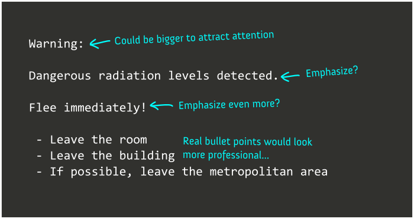
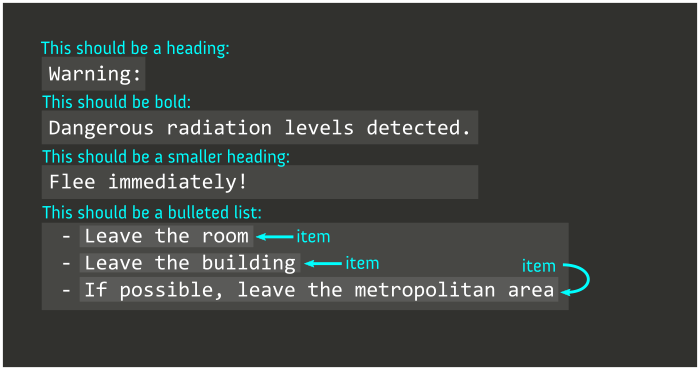

# The Modern Web, via Vue

## Part 1: HTML Review

In the beginning, the Internet was created. (This has made a lot of people very angry and has been widely regarded as a bad move.) Someone somewhere invented a way for a lot of computers to talk to each other at once and mostly normal people used this to send text messages back and forth in things like chat rooms. You could also get files from other people's computers using services like FTP and gopher, or type commands that would run on other people's computers using protocols like Telnet (which was a predecessor to what we use today, SSH); but pretty much all communication and all files just consisted of text, and by that I mean plain text. For example, the first computer-to-computer communication over what would eventualy become the Internet was [this](https://www.netvalley.com/cgi-bin/intval/net_history.pl?chapter=1):

> Kleinrock, a pioneering computer science professor at UCLA, and his small group of graduate students hoped to log onto the Stanford computer and try to send it some data. They would start by typing "login," and seeing if the letters appeared on the far-off monitor.
> 
> "We set up a telephone connection between us and the guys at SRI...," Kleinrock ... said in an interview: "We typed the L and we asked on the phone,
> 
> "Do you see the L?"
> 
> "Yes, we see the L," came the response.
> 
> "We typed the O, and we asked, "Do you see the O."
> 
> "Yes, we see the O."
>
> "Then we typed the G, and the system crashed."
> 
> Yet a revolution had begun."

So plain text is great if you plan to do technical stuff like logging into remote computers and sending simple commands back and forth. But in other situations, it lacks a certain something.

```text
Warning:

Dangerous radiation levels detected.

Flee immediately!

 - Leave the room
 - Leave the building
 - If possible, leave the metropolitan area
```

If you were designing a computer system that might need to send or display this message, is this how you'd want it to look? I can imagine ways to punch it up a little.



But unfortunately, especially back then, you couldn't just, like, write some notes on some text and have the computer spit out a formatted version. We might want to get more specific:



But really, what we're going to want to do is to try to take this information that I have indicated in this image here and come up with a way to express it within text. Then, we'll be able to send a plain text message over the Internet that gets interpreted and displayed as formatted text. The text that the sending computer sends and the text that the receiving computer displays is pretty much just going to be different. The sending computer is going to send something that looks like this:

```html
<h1>Warning:</h1>
<strong>Dangerous radiation levels detected.</strong>
<h2>Flee immediately!</h2>
<ul>
    <li>Leave the room</li>
    <li>Leave the building</li>
    <li>If possible, leave the metropolitan area</li>
</ul>
```

And the receiving computer is going to display something that looks like this:

# Warning:

**Dangerous radiation levels detected.**

## Flee immediately!

- Leave the room
- Leave the building
- If possible, leave the metropolitan area

So that's the magic trick that HTML lets us pull off. On one hand, we send some plain text that looks really weird, and on the other hand, the receiver displays formatted text that looks nice. And that works because the receiving computer knows to take the HTML and get rid of parts of it and transform the rest when it's displayed to make it look okay.

So, basically, we added some extra text within angle brackets, called "tags." Angle brackets are what we call these: \<>. If you put angle brackets with a name (meaning a word or some initials) inside them, that means "apply the format with this name to the text, starting here"; if you put angle brackets with a slash and then a name, it means "stop applying the format with this name to the text, starting here." The names of formats in HTML are a bit short and cryptic; we have things here like "ul", which means "unordered list", which means "list that uses bullet points and not numbers." And to write in HTML, you just kind of have to memorize all the tag names and what they mean. But that's the easy part, honestly.

And, a word of warning to beginners: HTML, which is what this is, started out as a way to format text, but gradually its uses began to expand and expand until at this point it's also used to divide text and other content on a page into sections so that those sections can then be layed out, in like, rows and columns and things, and sometimes to provide standalone content that has nothing to do with text, like images or videos. And that gets complicated. The little words in angle brackets that initially indicated text formatting now stand on their own to indicate other content and just kind of divide text into abstract sections sometimes. But we'll get through it, I promise.

## Part 2: The Modern Web

So, HTML is all well and good, but in its raw form, it's very non-interactive: the text that you put in the HTML tags just kind of sits there. That's boring. Also, it's not very organized; everything you want to display on web page, you're usually going to have to put in one single file, which can get kind of sprawling and messy. (Unless you use iframes, which introduce other complications, like figuring out what size they should be.) There are a lot of systems that promise to give you the ability to write organized, interactive HTML: React, Svelte, Web Components, Angular, etc, but the one I have chosen to look at today is called Vue. And if you go to this StackBlitz link, *(TODO: add link)* you're going to be able to write some HTML within the Vue framework.

So, as we can see, there are three basic sections in a Vue file. We have the `<template>` section, which is where you put HTML; we'll see why it's called "template" in a second. There's the `<script setup>` section, which is where you can put JavaScript code that makes your HTML changeable and interactive. And there's the `<style>` section, which is where you put CSS that lets you change the style and layout of your HTML.

```html
<template>
<!-- HTML content goes here -->
</template>

<script setup>
// JavaScript for interactive content goes here
</script>

<style scoped>
/* CSS for style & layout goes here */
</style>
```

So, yeah, there are three different programming languages involved here, and the default way that you write comments is different in all three of them, because God hates us. This whole thing, which basically creates a piece of a web page that you can also use multiple times, is called a Vue component. Pretty much none of the modern web is created with pure, raw, free-range HTML anymore; instead, you create a little segment of HTML and package some specific, related JavaScript and CSS with it, which is called a "component" by various different frameworks and systems.

So, let's go ahead and paste the HTML that I wrote earlier in the "template" section. I'll paste into the chat so you don't have to copy it all down. The result:

```html
<template>
  <!-- HTML content goes here -->
  <h1>Warning:</h1>
  <strong>Dangerous radiation levels detected.</strong>
  <h2>Flee immediately!</h2>
  <ul>
      <li>Leave the room</li>
      <li>Leave the building</li>
      <li>If possible, leave the metropolitan area</li>
  </ul>
</template>

<script setup>
// JavaScript for interactive content goes here
</script>

<style scoped>
/* CSS for style & layout goes here */
</style>
```

So, yeah. In the result pane on the right, you should see formatted text. We put HTML in, and we get formatted text back out. (In this case there isn't really a sending computer and a receiving computer; like, both of those computers are the same one, yours; but the point still stands.)


*TODO: when creating new, different components later, bring up the fact that the styles in a `<style scoped>` tag don't affect other components, which is useful sometimes*
